# CVFX-HW2-17
### 1. Training MUNIT
由於一百萬個 iteration 實在太多，且不一定全部 train 完結果才是最好。因此，我們認為 train 到八十幾萬的效果是最好的。

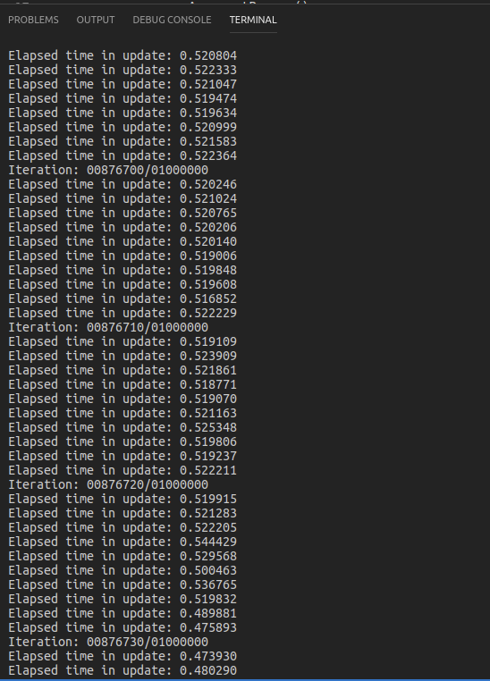
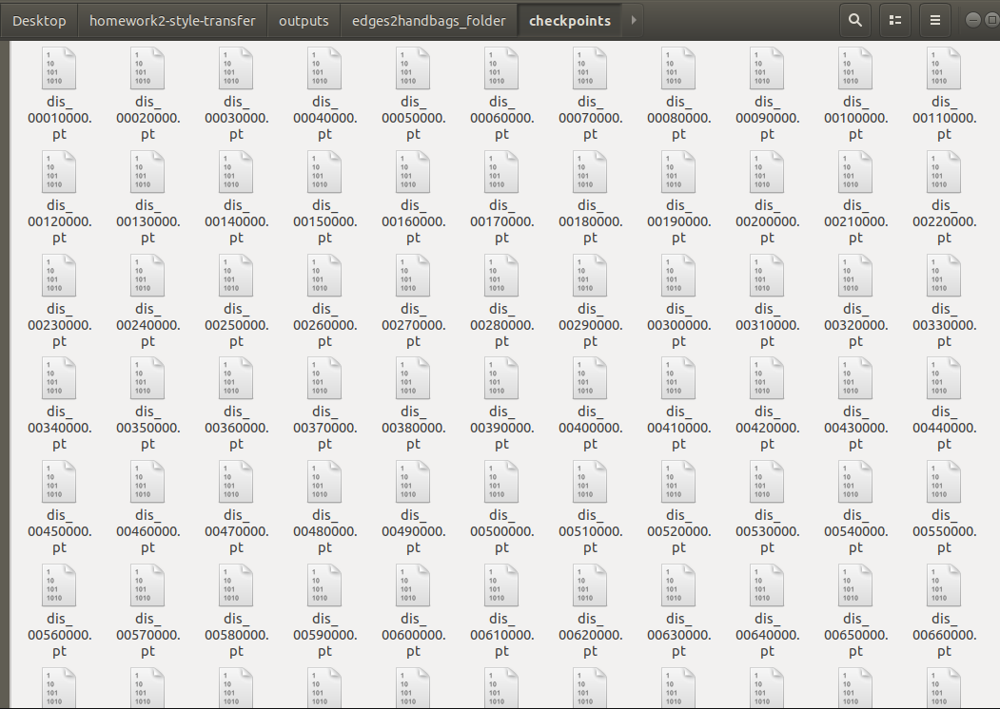
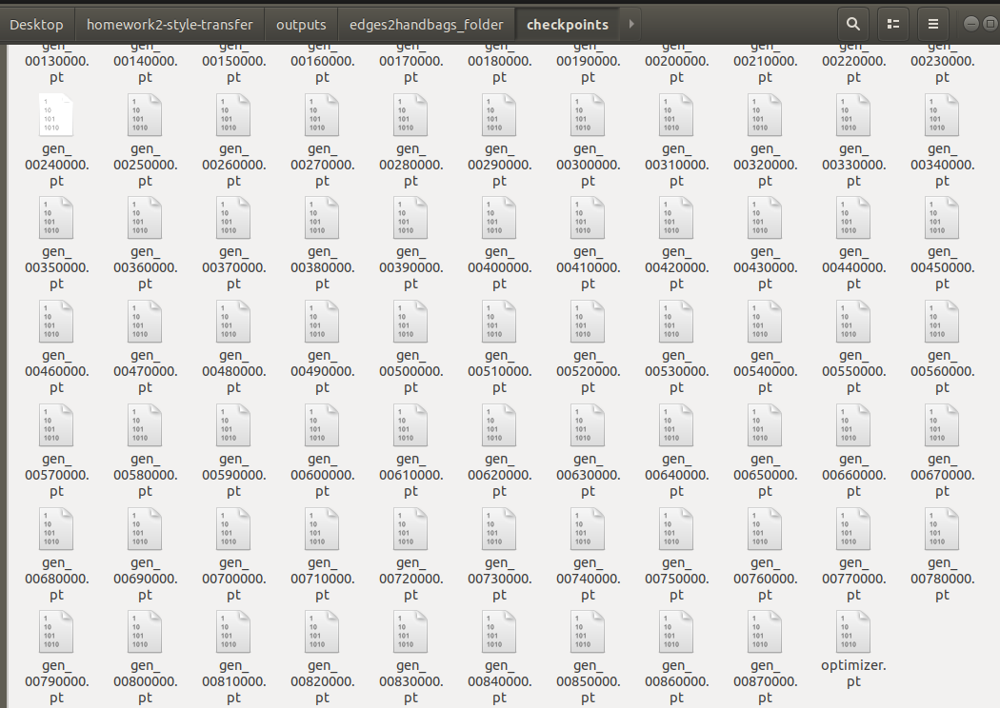

### 2. Inference one image in multiple style
> 我們選擇 edges2handbags 這個 dataset，因為此 dataset 的多樣性較高，較容易分辨出好壞。以下為原圖以及五張經 style transfer 的結果圖，content 欄中左邊是 content input，右邊是原 pair 圖。

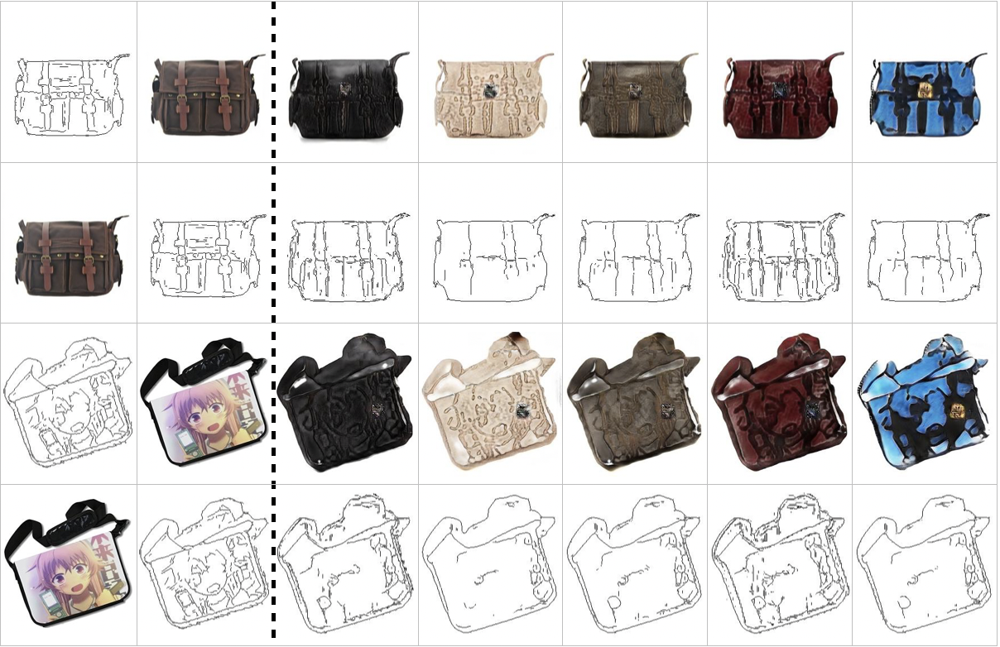
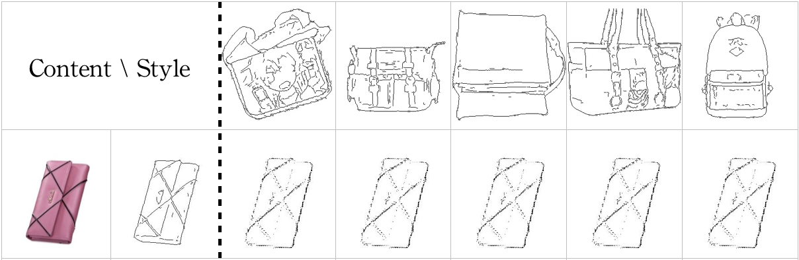

上圖為 content input 給予 bag，style input 給予不同 edge 圖，可以發現 output 的結果差異並不大，我們猜測可能是 edge 的 style 都會落到相同的 domain 導致輸出結果幾乎一樣，我們也有將 code 中 image style encode 的結果進行比對，並發現這五張的數值如同我們的假設是相同的 。

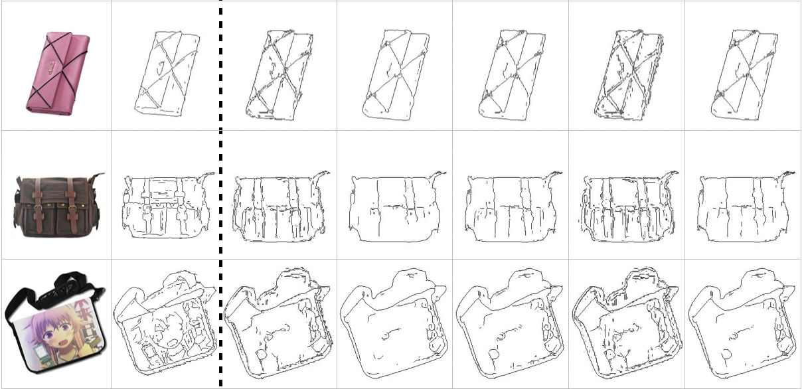

經過上面的發現我們就將 style input 改為 random，可以發現雖然 output 有點類似但在細節上還是有差異。

### 3. Compare with other method
> 目標：首先給定兩張影像，一張為 style image，另一張為 target image，使得能夠保存 target image 中的內容，但套用 style image 中的風格，最後 generated image 為一張全新的 stylized image，以達到 style transfer 的效果，以下介紹兩種方法來做比較。

#### Method 1: [FastPhotoStyle](https://github.com/NVIDIA/FastPhotoStyle)

此方法分為兩個步驟（流程圖如下）：
1. Stylization
    此步驟會分析 style image 的風格，並套用至 target image，其中使用較特別的 Photo WCT (Whitening and Coloring Transform) 方法來完成轉換，效果會比原先的 WCT 還要好，但因為合成的關係，還是存在一些 aliasing。
2. Smoothing
    此步驟為了讓結果圖片看起來更自然，則會再輸入目標以及含有 aliasing 的照片，來比對圖中鄰近的區域，將相近的像素套入相同的風格，使得畫面更為滑順，發揮降低破綻的效果。

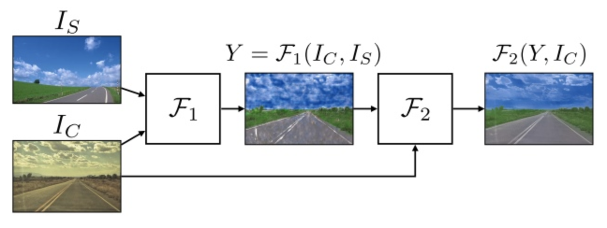

以下為我們的圖片使用 FastPhotoStyle Algo 的圖片結果。

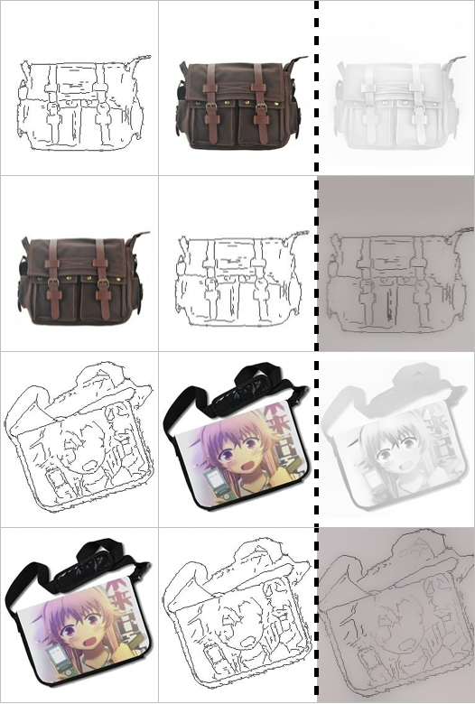

#### Method 2: [neural-style](https://github.com/anishathalye/neural-style)

此方法主要利用卷積神經網絡（利用 pretrain 的 Pre-trained VGG network model）來提取圖片的特徵，同時將圖片的 content 和 style 分隔出來並分別做 reconstruction，而在合成時考慮 content loss 與 style loss 的最小化，使得合成出來的圖像會保證在 content 和 style 的 reconstruction 上更準確。

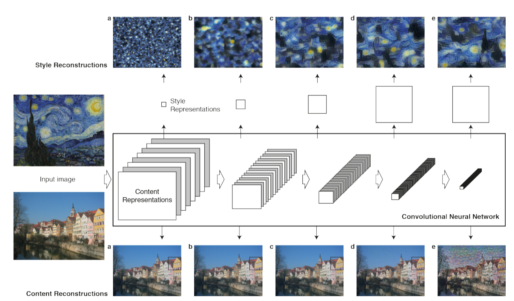

此方法分為四個部分（流程圖如上）：
1. Content Reconstruction
    下圖中下面部分是 Content Reconstruction 對應於 CNN 中的 a、b、c、d 以及 e 層，model 最開始標了 Content Representations 是代表經過了 Pre-trained 之後的 VGG network model 的圖像數據，主要用來生成圖像的 Content Representations。經過了五層卷積網絡來做 Content 的重構之後，從中可以觀察出在前 3 層的 Content Reconstruction 效果比較好，後面兩層丟失了部分細節，反而保留了較 high level 的細節。

2. Style Reconstruction
    此方法的重建與前者雷同，不同點在於 a、b、c、d、e 的處理方式不同。它使用每一層不同 filter 之間的 correlations 來代表該層提取到的 texture information，然後來對 style 進行重建，這樣的做法會在各個不同的尺度上更加匹配圖像本身的 style，忽略場景的全局信息。

3. Content Loss
    下圖為計算公式，其中 F^l 表示產生的 Content Representation 在第 l 層的數據，則 P^l 表示原始圖片在第 l 層的數據，然後試圖 minimize 兩者的 Least Square Error。

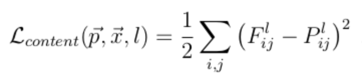

4. Style Loss
    下圖為計算公式，其中 A^l 表示原始 style image 在第 l 的數據，而 G^l 表示產生的 Style Representation 在第 l 層的數據，同樣試圖 minimize 兩者的 Least Square Error，只是要額外包含每一層輸出的 errors 之和。
    
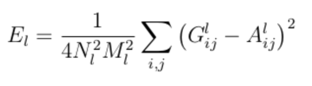
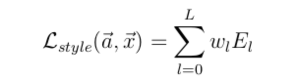

以下為我們的圖片使用 neural-style Algo 的圖片結果。

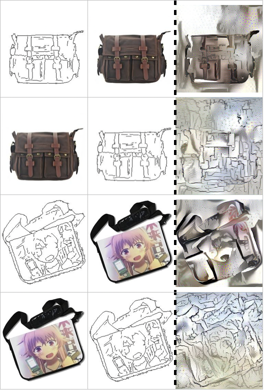

#### 分析比較：

我們觀察出 FastPhotoStyle 較適合處理一般風景照或是藝術照，因為這些風格的照片沒有較特別的 pattern。由於此方法的第二步是 smoothing，會採用鄰近 pixels 的風格，當遇到相同的 pattern 較多時，圖片經過 style transfer 之後反而會壞掉，如下圖。

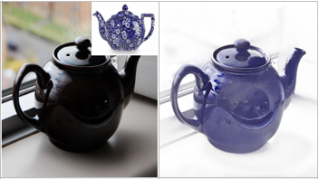

而我們發現 neural-style 的方法較適合人物、山水、建築等等大場景內容，並不適合小物件內容，例如包包、鞋子等，失敗的結果如 Method 2 所提供的圖片。

### 4. Conclusion
藉由這次的作業了解到了風格轉換並不像以前只停留在一對一的圖片轉換，一張圖片也可以被拆解為 content code 和 style code，跳脫了傳統以 pixel 或 image level 來看待風格轉換的角度，在運用其他種方法來進行風格轉換時，會發現在不同領域，如 edge2bag 和 summer2winter，在FastPhotoStyle 中的範例大部分都是使用風景圖，圖片結果用肉眼來看還不錯，然而用 edge2bag 的 data 來測試會發現完全得不到好的結果，只有圖片顏色的稍稍改變，看來不同的方法還是有著適合的圖片類型。
